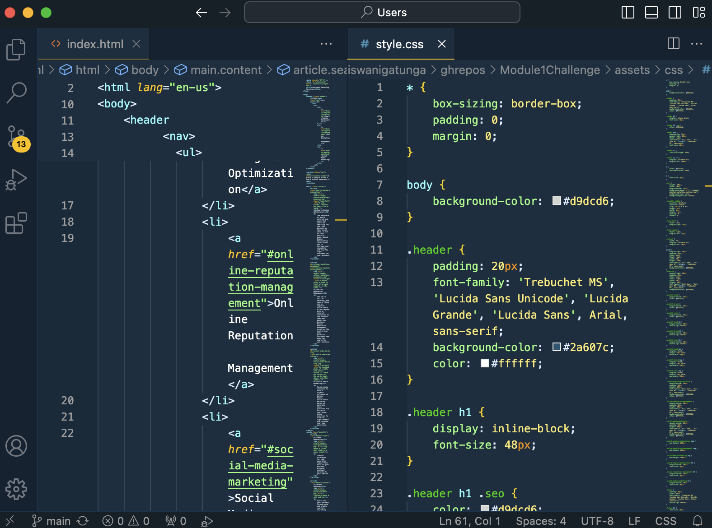

# <Horizon-Refactoring-Module-1-Challenge>

## Description

My motivation to create this project was to change the code to semantic HTML and create a more accessible webpage. I refactored this code to make the code user friendly for additional team members and to make the code accessible to users with disabilities. This solves the problem of having difficulty collaborating with other coders and provides access to users with disabilities. I learned how to write semantic HTML code and work with CSS while refactoring the code.

## Installation

Access the code at https://github.com/stefanfilm/Module1Challenge 

Open the index.html file and the style.css file in a code editor.

Open the index.html file in the default browser to view the code online

## Usage

Access the repository and open the HTML and CSS in a code editor.

    

## Credits

I worked with code provided by UC Berkeley Full Stack Coding Bootcamp.

## License

The code belongs to UC Berkeley Full Stack Coding Bootcamp.

## Badges
